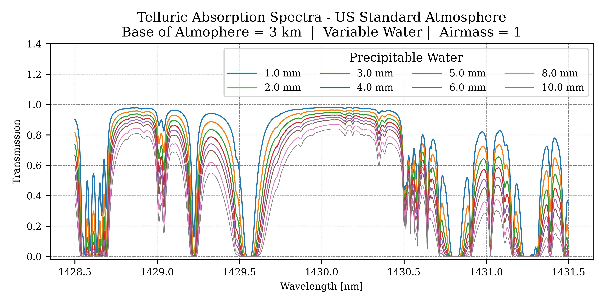
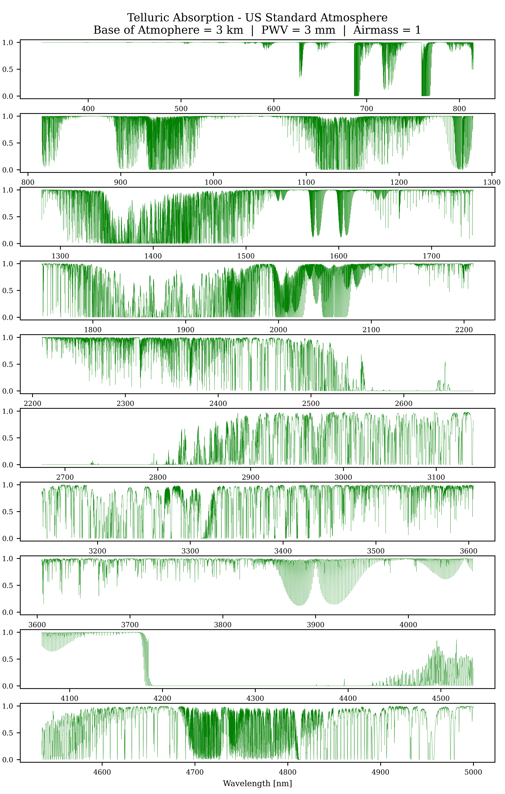

## DKIST Telluric Atlases

Looking for synthetic transmission spectra for a ground based telescope?  You're in luck! 
Is that telescope the Daniel K Inouye Solar Telescope (DKIST)? Even better! 

This repository provides high spectral resolution (R ~ 1 million) synthetic telluric spectra from 350 to 5000 nm for the US standard terrestrial atmosphere with a base height of 3 km, where DKIST is located on Haleakala on the Island of Maui.  Included are standard files for various airmasses and precipitable water vapor.  See the ./atlases/ directory for more information.  There is no need to install anything for using these files as is.  No Warranty or Guarantees Implied. 

In addition, this repo provides the documentation necessary to create these files for yourself, as well as investigate other atmospheric parameters. This work relies on [The HITRAN Database
](https://www.hitran.org) for the molecular line parameters.  The synthesis approach utilizes the the Python for Computational ATmospheric Spectroscopy [Py4CAtS](https://atmos.eoc.dlr.de/tools/Py4CAtS/) package.

Here is an example of the type of spectra created here.  See the full spectral range in the figure below. 



## Project Setup of Python Packages

To use this repository for yourself, you should setup a python environment with the tools you require.  This repo has been developed with an environment including multiple tools (e.g. including numpy scipy ipython matplotlib jupyter-lab, etc.)  Python >3.10 is listed as a requirement for Py4Cats.  

You need to download the Py4Cats package for use.  The website for [Py4CAtS](https://atmos.eoc.dlr.de/tools/Py4CAtS/) as of 7 March 2024 shows an installation option using an available python wheel file, which is new as of Dec 2023 v3.2.0.  I could not get this option to work presently, and instead I rely on downloading the package tarball directly into the project directory for use, i.e. 

```
wget -nH https://atmos.eoc.dlr.de/tools/Py4CAtS/py4cats.tgz
tar zxvf py4cats.tgz
```

The package tarball, as downloaded March 2024, is included in this repo, under the permissibility of the Py4CAtS GNU General Public License.  

Once downloaded, a quick test import can be done in your project directory from the command line.

```
python -c "import py4cats"
```

## HiTRAN database parameters 

The notebooks assume the HiTRAN database covering 350 to 5000 nm is already in a project subdirectory called "HITRAN_VIS_IR".  The main database file is 220 MB, i.e. larger than GitHUB file size limits.  So, you need to obtain this file for yourself.  There are multiple options. 

First, create the directory in the project directory: 

```
mkdir HITRAN_VIS_IR 
cd HITRAN_VIS_IR
```

To get the HITRAN database parameters:

#### Option 1:  Download files from previously performed querys on Hitran.org: 

The previous HITRAN queries remain available for some (unknown) period of time, and can be downloaded with wget as follows:
```
wget https://hitran.org/results/65e912c9.par
wget https://hitran.org/results/65e912c9.bib.html
wget https://hitran.org/results/65e912c9.bib
wget https://hitran.org/output-format-readmes/readme-1.txt
```
Here are the sizes of the files:
```
(dkist_telluric_atlas) [tschad@cn7 HITRAN_VIS_IR]$ ls -lath 
total 221M
drwxrwxr-x 2 tschad dkist    6 Mar  6 15:08 .
drwxrwxr-x 3 tschad dkist    3 Mar  6 15:06 ..
-rw-rw-r-- 1 tschad dkist 174K Mar  6 15:05 65e912c9.bib
-rw-rw-r-- 1 tschad dkist 249K Mar  6 15:05 65e912c9.bib.html
-rw-rw-r-- 1 tschad dkist 220M Mar  6 15:05 65e912c9.par
-rw-rw-r-- 1 tschad dkist 3.5K Jun 14  2023 readme-1.txt
```

#### Option 2 -- Regenerate queried data on Hitran.org 


1. Go to https://hitran.org/ 
2. Select Data Access > Line-by-Line Search 
Select first 7 individual molecules on top (these are the 'main' molecules)
Click "select isotopologues"
Click "Select wavenumber / wavelength range" (accepting default isotopologues )
Enter range of wavenumbers:  vmin = 1990; vmax = 28600 (this covers ~350 to 5000 nm)
Click "select output options"
login if necessary 
Selection *.par (160 chars) output on left and click "Start Data Search"
Download all 4 files generated and place in an accessible folder 

### Run example notebook 

With the tools in place and the database copied into the correct subdirectory, you should be able to run through the example notebooks. 

The first example notebook (1_telluric_1430_nm.ipynb) shows an example of using these tools to generate spectra near 1430 nm (or other bandpasses).  

The main notebook that creates the files within the ./atlases/ directory is 2_create_DKIST_telluric_atlases.ipynb).  It does implement simple multiprocessing with python standard tools.  The full database of files takes ~ 17 minutes to generate on 75 processes on a 40 core (2 thread) cpu.  

Here is one same image of the telluric spectra covering the full 350 to 5000 nm range. It is generated with the US Standard Reference atmosphere with a base height of 3 km.  The water content is scaled to a precipitable water vapor depth of 3 mm, which is close to the 3.4 mm of the original reference atmosphere above 3 km. These spectra are at 1 airmass.



## References 

Please see the [HITRAN](www.hitran.org) amd [Py4CAtS](https://atmos.eoc.dlr.de/tools/Py4CAtS/) for more information about the database and the python package.  For more information about DKIST, see the [National Solar Observatory's website](https://nso.edu/telescopes/dki-solar-telescope/).

I. E. Gordon, L. S. Rothman, R. J. Hargreaves, R. Hashemi, E. V. Karlovets, F. M. Skinner, et al., "The HITRAN2020 molecular spectroscopic database", J. Quant. Spectrosc. Radiat. Transfer 277, 107949 (2022). [doi:10.1016/j.jqsrt.2021.107949]

F. Schreier, S. Gimeno García, P. Hochstaffl and S. Städt. Py4CAtS --- Python for Computational ATmospheric Spectroscopy. Atmosphere 10(5), 262, 2019, doi: 10.3390/atmos10050262

F. Schreier and S. Gimeno Garcia. Py4CAtS – Python Tools for Line-by-Line Modelling of Atmospheric Radiative Transfer. In Robert F. Cahalan and Jürgen Fischer (editors), Radiation Processes in the Atmosphere and Ocean (IRS 2012): Proceedings of the International Radiation Symposium (IRC/IAMAS) Volume 1531 of AIP Conference Proceedings, pages 123 - 126. American Institute of Physics, 2013. doi: 10.1063/1.4804723

F. Schreier and P. Hochstaffl. Py4CAtS --- Python for Computational ATmospheric Spectroscopy. GSICS Quarterly 13(4), pp. 6 - 8, 2020, doi: 10.25923/ymt5-wz59

See also GARLIC (Generic Atmospheric Radiation Line-by-line Infrared Code, Py4CAtS' big brother): JQSRT 137, 29-50, 2014, doi: 10.1016/j.jqsrt.2013.11.018,
and our related projects lbl4IR

## Acknowledgements and Disclaimer 

The Daniel K. Inouye Solar Telescope (DKIST) is a facility of the National Solar Observatory (NSO). NSO is managed by the Association of Universities for Research in Astronomy, Inc., and is funded by the National Science Foundation. Any opinions, findings and conclusions or recommendations expressed here are those of the author(s) and do not necessarily reflect the views of the National Science Foundation or the Association of Universities for Research in Astronomy, Inc.  DKIST is located on land of spiritual and cultural significance to Native Hawaiian people. The use of this important site to further scientific knowledge is done so with appreciation and respect.

Thanks to the HITRAN and Py4CAtS developers and maintainers for these very useful tools. 


